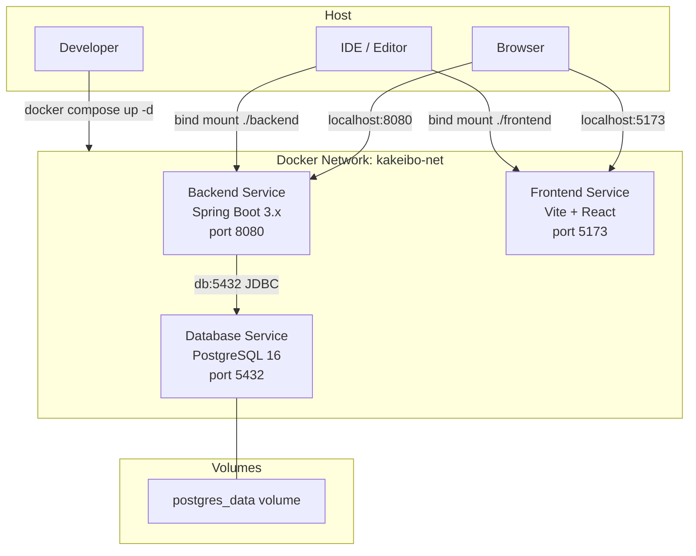
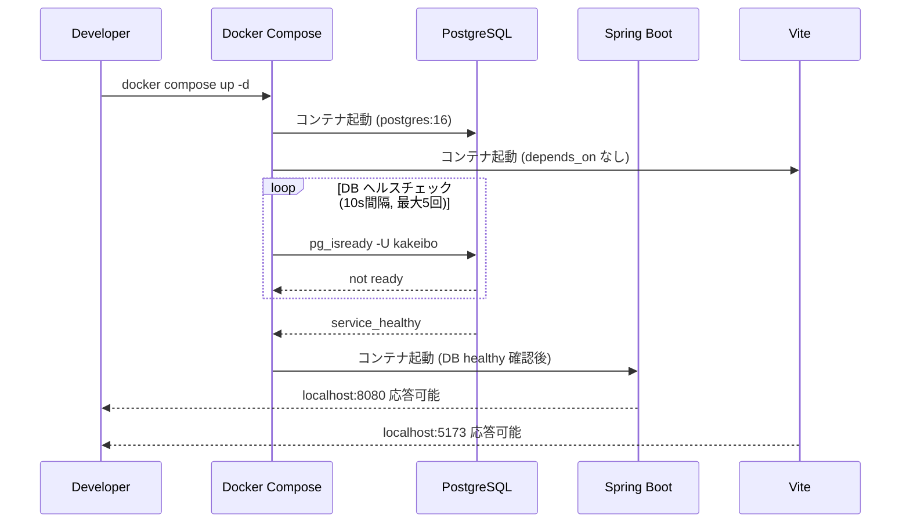
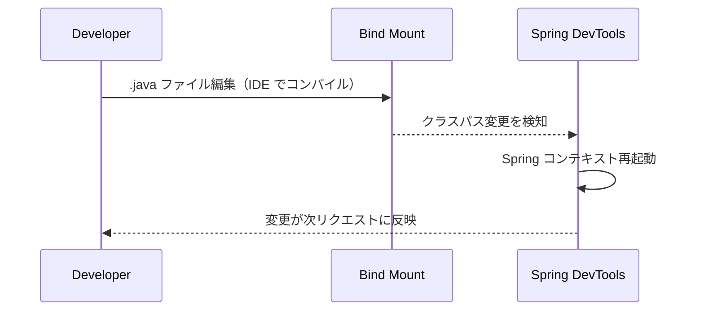

# Design Document: docker-infra

## Overview

`docker-infra` は 1s-kakeibo の開発環境基盤として、Docker Compose による3サービス（Spring Boot / Vite+React / PostgreSQL）の統合開発環境を提供する。開発者は `docker compose up -d` 一発で全サービスを起動でき、ホスト上のソースコード変更が即座にコンテナに反映される。

**Purpose**: 後続のすべての spec（auth / expense-management / budget-dashboard）が依存するインフラ基盤を確立する。  
**Users**: 1s-kakeibo を開発するエンジニアが、ローカル環境構築の手間なく開発を開始できるようにする。  
**Impact**: グリーンフィールドプロジェクトルートに Docker Compose 設定・各サービス雛形・環境変数テンプレートを配置する。

### Goals
- `docker compose up -d` で backend(8080) / frontend(5173) / db(5432) を一括起動
- Spring Boot DevTools によるバックエンドホットリロード
- Vite HMR によるフロントエンド自動更新（Docker bind mount 対応）
- PostgreSQL データを名前付きボリュームで永続化
- `.env.example` により環境変数管理を標準化

### Non-Goals
- Nginx / リバースプロキシ設定
- 本番向けマルチステージ Dockerfile
- CI/CD パイプライン
- アプリケーションのビジネスロジック（auth / expense / budget 各 spec が担当）
- Flyway マイグレーション（auth spec が担当）

---

## Boundary Commitments

### This Spec Owns
- `docker-compose.yml`（サービス定義・ネットワーク・ボリューム・起動依存関係）
- `backend/Dockerfile.dev`（Spring Boot 開発用コンテナ）
- `frontend/Dockerfile.dev`（Vite 開発用コンテナ）
- バックエンド雛形コード（Spring Boot main class + `/api/health` エンドポイント）
- フロントエンド雛形コード（Vite + React + TypeScript + TailwindCSS の Hello World）
- `.env.example`（全サービスが必要とする環境変数テンプレート）
- `CLAUDE.md` の Build/Run コマンドセクション更新

### Out of Boundary
- Flyway DB マイグレーション（auth spec が `users` テーブルから管理）
- Spring Security・JWT 設定（auth spec が担当）
- ビジネスロジック API（expense-management / budget-dashboard が担当）
- 本番用 Dockerfile・デプロイ設定
- Nginx・SSL 設定

### Allowed Dependencies
- Docker Engine 24+ / Docker Compose v2（ローカル開発環境の前提）
- `eclipse-temurin:21-jdk`（公式 JDK 21 イメージ）
- `node:20-alpine`（公式 Node.js LTS イメージ）
- `postgres:16`（公式 PostgreSQL イメージ）

### Revalidation Triggers
- ポート番号変更（8080 / 5173 / 5432）→ 後続 spec のフロントエンド API 呼び出し先に影響
- サービス名変更（`db` / `backend` / `frontend`）→ Docker 内部 DNS に依存する後続 spec の application.properties に影響
- 環境変数名変更（`POSTGRES_DB` 等）→ auth spec の application.properties に影響
- ベースイメージバージョン変更 → 後続 spec の動作に影響する可能性

---

## Architecture

### Architecture Pattern & Boundary Map



**Architecture Integration**:
- 選択パターン: Bind mount + Docker Compose healthcheck による依存関係制御
- サービス境界: 各サービスは独立した Dockerfile を持ち、ソースは bind mount で提供
- ホットリロード: バックエンドは Spring DevTools（クラスパス変更検知）、フロントエンドは Vite HMR（usePolling で Docker bind mount に対応）

### Technology Stack

| Layer | Choice / Version | Role in Feature | Notes |
|-------|-----------------|----------------|-------|
| Container Orchestration | Docker Compose v2 | サービスライフサイクル管理 | healthcheck/depends_on で起動順制御 |
| Backend Runtime | eclipse-temurin:21-jdk | Java 21 JDK ベースイメージ | 公式 Adoptium イメージ |
| Backend Framework | Spring Boot 3.x + Gradle | アプリ雛形・DevTools ホットリロード | spring-boot-devtools を dev 依存に追加 |
| Frontend Runtime | node:20-alpine | Node.js LTS ベースイメージ | Alpine で軽量化 |
| Frontend Framework | Vite 5.x + React 18 + TypeScript 5 | HMR 付き開発サーバー | usePolling で Docker 対応 |
| CSS Framework | TailwindCSS 3.x | ユーティリティ CSS | PostCSS 経由で Vite に統合 |
| Database | postgres:16 | PostgreSQL データベース | 公式イメージ、名前付きボリューム |

---

## File Structure Plan

### Directory Structure

```
household-budget-app/
├── docker-compose.yml              # 全サービス定義・ネットワーク・ボリューム
├── .env.example                    # 環境変数テンプレート（コミット対象）
├── .env                            # 実際の値（.gitignore で除外）
├── .gitignore                      # .env・build 成果物を除外
├── backend/
│   ├── Dockerfile.dev              # 開発用: eclipse-temurin:21-jdk + bootRun
│   ├── build.gradle                # Spring Boot 3.x + DevTools + Web + JPA + PostgreSQL Driver
│   ├── settings.gradle             # プロジェクト名: kakeibo
│   ├── gradlew                     # Gradle Wrapper スクリプト
│   ├── gradlew.bat
│   ├── gradle/wrapper/
│   │   └── gradle-wrapper.properties
│   └── src/main/
│       ├── java/com/kakeibo/
│       │   ├── KakeiboApplication.java         # @SpringBootApplication エントリポイント
│       │   └── presentation/
│       │       └── HealthController.java        # GET /api/health → 200 {"status":"ok"}
│       └── resources/
│           └── application.properties           # DB 接続設定（環境変数参照）、Flyway 無効化
└── frontend/
    ├── Dockerfile.dev              # 開発用: node:20-alpine + npm install + npm run dev
    ├── package.json                # react, vite, typescript, tailwindcss 依存
    ├── vite.config.ts              # host:0.0.0.0、usePolling:true、hmr.host 設定
    ├── tsconfig.json
    ├── tsconfig.node.json
    ├── postcss.config.js           # TailwindCSS PostCSS プラグイン設定
    ├── tailwind.config.js          # content パス設定
    └── src/
        ├── main.tsx                # React エントリ: <App /> をマウント
        ├── App.tsx                 # ルートコンポーネント: Hello World ページ
        └── index.css               # @tailwind base/components/utilities
```

### Modified Files
- `CLAUDE.md` — Build/Run コマンドセクションを実際の `docker compose` コマンドに更新

---

## System Flows

### Startup Sequence（起動依存関係）



Key Decision: `backend` の `depends_on: db: condition: service_healthy` により、DB 未準備での接続エラーを防ぐ。

### Hot Reload Flow（バックエンド）



Note: IDE によるコンパイル（.class 生成）が Spring DevTools のトリガー。Gradle の継続ビルドを用いる場合は research.md を参照。

---

## Requirements Traceability

| Requirement | Summary | Components | Flows |
|-------------|---------|------------|-------|
| 1.1 | `docker compose up -d` で3サービス起動 | docker-compose.yml | Startup Sequence |
| 1.2 | ポートマッピング 8080/5173/5432 | docker-compose.yml | Startup Sequence |
| 1.3 | `.env.example` 提供 | .env.example | — |
| 1.4 | `docker compose logs -f` でログ確認 | docker-compose.yml | — |
| 2.1 | localhost:8080 疎通 | HealthController, Dockerfile.dev | — |
| 2.2 | バックエンドホットリロード | Dockerfile.dev, docker-compose.yml | Hot Reload Flow |
| 2.3 | backend/ 雛形配置 | KakeiboApplication, build.gradle | — |
| 2.4 | DB 準備完了後にバックエンド起動 | docker-compose.yml (depends_on/healthcheck) | Startup Sequence |
| 3.1 | localhost:5173 ページ表示 | Frontend Dockerfile.dev, App.tsx | — |
| 3.2 | フロントエンド HMR | vite.config.ts, Dockerfile.dev | — |
| 3.3 | frontend/ 雛形配置 | package.json, App.tsx, tailwind.config.js | — |
| 4.1 | PostgreSQL ポート 5432 接続 | docker-compose.yml (postgres:16) | Startup Sequence |
| 4.2 | コンテナ再起動後データ保持 | postgres_data 名前付きボリューム | — |
| 4.3 | バックエンド→DB コンテナネットワーク | docker-compose.yml (kakeibo-net) | — |

---

## Components and Interfaces

### Components Summary

| Component | Layer | Intent | Req Coverage | Contracts |
|-----------|-------|--------|-------------|-----------|
| docker-compose.yml | Infra | 全サービス定義・起動依存・ネットワーク・ボリューム | 1.1, 1.2, 1.4, 2.2, 2.4, 4.1, 4.2, 4.3 | Service |
| backend/Dockerfile.dev | Container | Spring Boot 開発コンテナイメージ | 2.1, 2.2, 2.3 | — |
| KakeiboApplication.java | Backend | Spring Boot エントリポイント | 2.3 | — |
| HealthController.java | Backend Presentation | GET /api/health エンドポイント | 2.1 | API |
| application.properties | Backend Config | DB 接続設定・Flyway 無効化 | 2.3, 2.4 | — |
| frontend/Dockerfile.dev | Container | Vite 開発コンテナイメージ | 3.1, 3.2, 3.3 | — |
| vite.config.ts | Frontend Config | Docker HMR 設定 | 3.1, 3.2 | — |
| App.tsx | Frontend UI | ルートコンポーネント（Hello World） | 3.1, 3.3 | — |
| .env.example | Config Template | 環境変数テンプレート | 1.3 | — |
| postgres_data (volume) | Storage | PostgreSQL データ永続化 | 4.2 | — |

---

### Infrastructure Layer

#### docker-compose.yml

| Field | Detail |
|-------|--------|
| Intent | 全サービスの起動・依存関係・ネットワーク・ボリュームを定義する単一のオーケストレーション設定 |
| Requirements | 1.1, 1.2, 1.4, 2.2, 2.4, 4.1, 4.2, 4.3 |

**Responsibilities & Constraints**
- `db` サービスに `pg_isready` ヘルスチェックを設定（interval: 10s, retries: 5）
- `backend` は `db: condition: service_healthy` を満たすまで起動しない（2.4）
- `backend` / `frontend` はバインドマウントでホスト側ソースをコンテナに同期（2.2, 3.2）
- `frontend` の `node_modules` は匿名ボリュームで保護（バインドマウントによる上書き防止）
- `postgres_data` 名前付きボリュームで DB データを永続化（4.2）

**Service Configuration Contract**

```yaml
services:
  db:
    image: postgres:16
    ports: ["5432:5432"]
    volumes:
      - postgres_data:/var/lib/postgresql/data
    env_file: .env
    healthcheck:
      test: ["CMD-SHELL", "pg_isready -U ${POSTGRES_USER} -d ${POSTGRES_DB}"]
      interval: 10s
      timeout: 5s
      retries: 5
      start_period: 10s

  backend:
    build:
      context: ./backend
      dockerfile: Dockerfile.dev
    ports: ["8080:8080"]
    volumes:
      - ./backend:/app
    depends_on:
      db:
        condition: service_healthy
    env_file: .env

  frontend:
    build:
      context: ./frontend
      dockerfile: Dockerfile.dev
    ports: ["5173:5173"]
    volumes:
      - ./frontend:/app
      - /app/node_modules
    env_file: .env

volumes:
  postgres_data:

networks:
  default:
    name: kakeibo-net
```

**Implementation Notes**
- Integration: `env_file: .env` で各コンテナに環境変数を注入。`.env` が存在しない場合は Docker Compose がエラーを出力する
- Validation: 初回起動前に `cp .env.example .env` を実行する手順を CLAUDE.md に記載する
- Risks: `start_period: 10s` は PostgreSQL の初期化時間を考慮した設定。初回起動（ボリューム初期化）では `retries: 5` を超える可能性があるため、`start_period` で猶予を設ける

---

#### backend/Dockerfile.dev

| Field | Detail |
|-------|--------|
| Intent | Java 21 + Gradle Wrapper を含む Spring Boot 開発用コンテナイメージ |
| Requirements | 2.1, 2.2, 2.3 |

**Responsibilities & Constraints**
- ベースイメージ: `eclipse-temurin:21-jdk`
- `WORKDIR /app`（ソースは bind mount で提供されるため COPY 不要）
- `CMD ["./gradlew", "bootRun"]` で起動
- Spring Boot DevTools がクラスパス変更を検知してコンテキストを再起動（2.2）

```dockerfile
FROM eclipse-temurin:21-jdk
WORKDIR /app
CMD ["./gradlew", "bootRun"]
```

**Implementation Notes**
- Risks: 初回起動時に Gradle が依存を Maven Central からダウンロードするため時間がかかる。Gradle ホームディレクトリをボリュームとしてキャッシュする最適化は MVP スコープ外
- Integration: Spring DevTools のホットリロードは IDE がソースをコンパイル（.class 生成）後に機能する。IDE なしで動作させる Gradle 継続ビルド方式については research.md を参照

---

#### frontend/Dockerfile.dev

| Field | Detail |
|-------|--------|
| Intent | Node.js 20 + npm install 済みの Vite 開発コンテナイメージ |
| Requirements | 3.1, 3.2, 3.3 |

**Responsibilities & Constraints**
- ベースイメージ: `node:20-alpine`
- `WORKDIR /app`
- `npm install` は Dockerfile 内でビルド時に実行しない（bind mount が上書きするため）
- `CMD ["npm", "install", "&&", "npm", "run", "dev"]` は不可。`ENTRYPOINT` で `npm install` 後に `npm run dev` を呼び出すか、または `docker-compose.yml` の `command` フィールドで制御

```dockerfile
FROM node:20-alpine
WORKDIR /app
EXPOSE 5173
CMD ["sh", "-c", "npm install && npm run dev"]
```

**Implementation Notes**
- Integration: `node_modules` は docker-compose.yml の匿名ボリュームにより保護される。コンテナ内の `npm install` で `node_modules` がボリュームに書き込まれ、ホストの空ディレクトリで上書きされない
- Risks: `npm install` がコンテナ起動のたびに実行されるが、`node_modules` がボリュームにキャッシュされるため2回目以降は高速

---

### Backend Layer

#### KakeiboApplication.java

| Field | Detail |
|-------|--------|
| Intent | Spring Boot アプリケーションエントリポイント |
| Requirements | 2.3 |

```java
package com.kakeibo;

import org.springframework.boot.SpringApplication;
import org.springframework.boot.autoconfigure.SpringBootApplication;

@SpringBootApplication
public class KakeiboApplication {
    public static void main(String[] args) {
        SpringApplication.run(KakeiboApplication.class, args);
    }
}
```

---

#### HealthController.java

| Field | Detail |
|-------|--------|
| Intent | バックエンド疎通確認用エンドポイントを提供する |
| Requirements | 2.1 |

**Contracts**: API [✓]

##### API Contract

| Method | Endpoint | Request | Response | Errors |
|--------|----------|---------|----------|--------|
| GET | /api/health | なし | `{"status": "ok"}` (200) | 500（サービス異常） |

```java
package com.kakeibo.presentation;

import org.springframework.http.ResponseEntity;
import org.springframework.web.bind.annotation.GetMapping;
import org.springframework.web.bind.annotation.RequestMapping;
import org.springframework.web.bind.annotation.RestController;
import java.util.Map;

@RestController
@RequestMapping("/api")
public class HealthController {
    @GetMapping("/health")
    public ResponseEntity<Map<String, String>> health() {
        return ResponseEntity.ok(Map.of("status", "ok"));
    }
}
```

---

#### application.properties

| Field | Detail |
|-------|--------|
| Intent | DB 接続先を環境変数から読み込み、Flyway を無効化する |
| Requirements | 2.3, 2.4 |

```properties
spring.datasource.url=${SPRING_DATASOURCE_URL}
spring.datasource.username=${SPRING_DATASOURCE_USERNAME}
spring.datasource.password=${SPRING_DATASOURCE_PASSWORD}
spring.jpa.hibernate.ddl-auto=none
spring.flyway.enabled=false
```

**Implementation Notes**
- `spring.flyway.enabled=false`: docker-infra フェーズでは Flyway マイグレーションを実行しない。auth spec が最初のマイグレーション（users テーブル）を追加した時点で `true` に変更する

---

### Frontend Layer

#### vite.config.ts

| Field | Detail |
|-------|--------|
| Intent | Docker bind mount 環境での HMR とホストバインドを設定する |
| Requirements | 3.1, 3.2 |

```typescript
import { defineConfig } from 'vite'
import react from '@vitejs/plugin-react'

export default defineConfig({
  plugins: [react()],
  server: {
    host: '0.0.0.0',
    port: 5173,
    watch: {
      usePolling: true,
    },
    hmr: {
      host: 'localhost',
      port: 5173,
    },
  },
})
```

**Key Decisions**
- `host: '0.0.0.0'`: コンテナ外（ホストブラウザ）からアクセス可能にする
- `usePolling: true`: Docker bind mount では inotify が機能しない場合があるため polling で変更検知
- `hmr.host: 'localhost'`: HMR WebSocket 接続先をホストの localhost に固定（コンテナ IP でなく）

---

#### App.tsx（Summary）

ルートコンポーネント。TailwindCSS クラスを使用した Hello World ページを表示する。後続の auth spec がルーティングとログインページに置き換える。

```typescript
export default function App() {
  return (
    <div className="flex items-center justify-center min-h-screen bg-gray-100">
      <h1 className="text-3xl font-bold text-gray-800">1s-kakeibo</h1>
    </div>
  )
}
```

---

## Data Models

このフェーズでは `docker-infra` はアプリケーションデータモデルを持たない。DB 接続設定のみを定義する。

### Environment Configuration

`.env.example` が定義する環境変数:

| 変数名 | 用途 | サンプル値 |
|--------|------|-----------|
| `POSTGRES_DB` | PostgreSQL データベース名 | `kakeibo_dev` |
| `POSTGRES_USER` | PostgreSQL ユーザー名 | `kakeibo` |
| `POSTGRES_PASSWORD` | PostgreSQL パスワード | `kakeibo_dev_password` |
| `SPRING_DATASOURCE_URL` | バックエンドの JDBC URL | `jdbc:postgresql://db:5432/kakeibo_dev` |
| `SPRING_DATASOURCE_USERNAME` | バックエンドの DB ユーザー | `kakeibo` |
| `SPRING_DATASOURCE_PASSWORD` | バックエンドの DB パスワード | `kakeibo_dev_password` |

`SPRING_DATASOURCE_URL` の `db` はコンテナ名（Docker ネットワーク内の内部 DNS）。

---

## Error Handling

| シナリオ | 検知方法 | 対応 |
|---------|---------|------|
| DB 起動前にバックエンドが接続試行 | depends_on + healthcheck | バックエンドを DB healthy まで起動遅延 |
| `.env` ファイルが存在しない | `docker compose up` 起動エラー | CLAUDE.md に `cp .env.example .env` 手順を記載 |
| ポートが既に使用中 | コンテナ起動エラー（port already in use） | CLAUDE.md にポート競合の確認コマンドを記載 |
| Gradle の初回依存解決が遅い | なし（仕様） | 初回起動は数分かかることを CLAUDE.md に注記 |

---

## Testing Strategy

| テスト種別 | テスト対象 | 検証内容 | 要件 |
|-----------|-----------|---------|------|
| 手動: 起動確認 | docker-compose.yml 全体 | `docker compose up -d` 後に全コンテナが `running` | 1.1 |
| 手動: ポート疎通 | Backend | `curl http://localhost:8080/api/health` → 200 `{"status":"ok"}` | 2.1 |
| 手動: ポート疎通 | Frontend | ブラウザで `http://localhost:5173` → Hello World ページ表示 | 3.1 |
| 手動: DB 接続 | Backend → DB | バックエンドログに DB 接続エラーがないこと | 2.4, 4.1 |
| 手動: ホットリロード | Backend | `.java` ファイル編集後に Spring DevTools 再起動ログが出ること | 2.2 |
| 手動: HMR | Frontend | `App.tsx` のテキスト変更後にブラウザが自動更新されること | 3.2 |
| 手動: データ永続化 | PostgreSQL | `docker compose down && docker compose up -d` 後に `docker exec` で DB にデータが残ること | 4.2 |
| 手動: ログ確認 | 全サービス | `docker compose logs -f` で3サービスのログがリアルタイム表示 | 1.4 |
